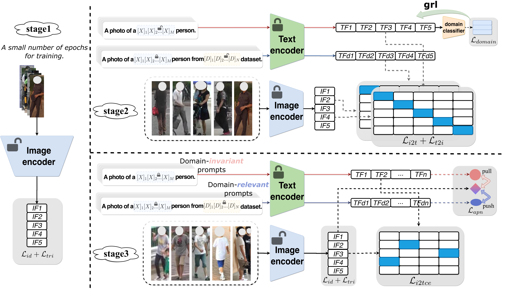
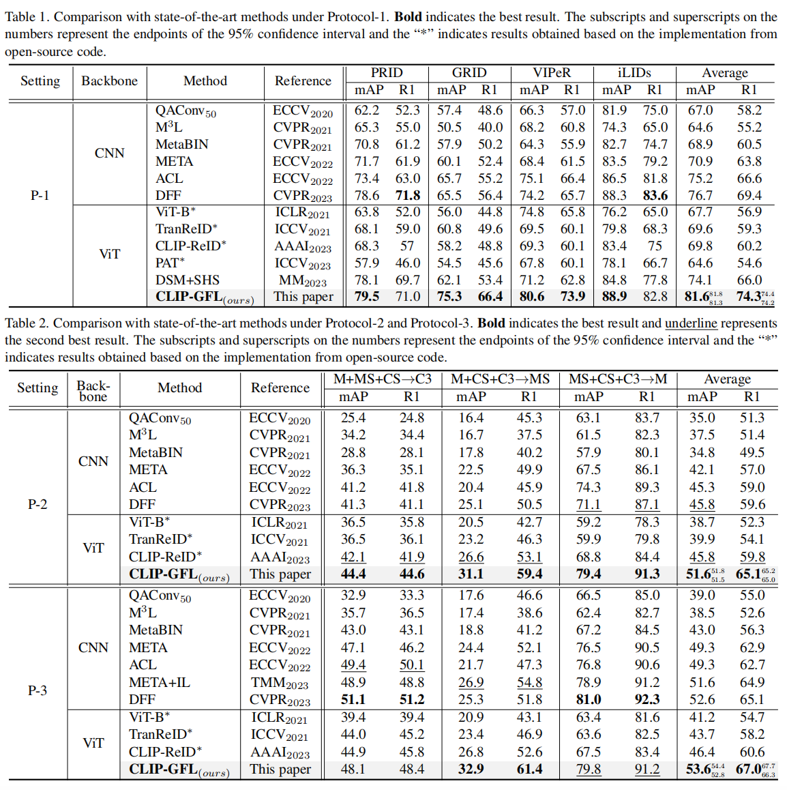

## Exploiting Vision-Language Model for Generalized Feature Learning





## Requirements

##### Our code is modified and organized based on [CLIP-ReID](https://github.com/Syliz517/CLIP-ReID).

Thanks for their contributions.

This is our code repository.

 You can run the project by modifying the corresponding configuration (cfg) files and using the run.py script.

```shell
cfgs
datasets
directory_result.txt
loss
models
reidutils
run.py
solver

./cfgs:
	__init__.py
	cfgs.py

./datasets:
  __init__.py
  bases.py
  build.py
  common.py
  cuhk02.py
  cuhk03.py
  cuhk_sysu.py
  grid.py
  iLIDS.py
  market1501.py
  msmt17.py
  prid.py
  samplers
  trans
  viper.py

  ./datasets/samplers:
    __init__.py
    sampler.py

  ./datasets/trans:
    __init__.py
    build_trans.py
    functional.py
    trans.py

./loss:
  __init__.py
  apn_loss.py
  arcface.py
  center_loss.py
  circle_loss.py
  contrastive_loss.py
  make_loss.py
  metric_learning.py
  softmax_loss.py
  supcontrast.py
  triplet_loss.py

./models:
  CLIP.py
  GFNet.py
  __init__.py
  clip
  vision_transformer.py

  ./models/clip:
    __init__.py
    bpe_simple_vocab_16e6.txt.gz
    clip.py
    model.py
    simple_tokenizer.py

./reidutils:
  __init__.py
  comm.py
  file_io.py
  logger.py
  meter.py
  metrics.py
  registry.py
  reranking.py

./solver:
  __init__.py
  cosine_lr.py
  lr_scheduler.py
  make_optimizer.py
  make_optimizer_prompt.py
  scheduler.py
  scheduler_factory.py
```


## Experimental Result

We achieved the highest average performance across *three popular  experimental protocols* for **cross-domain person re-identification**.




